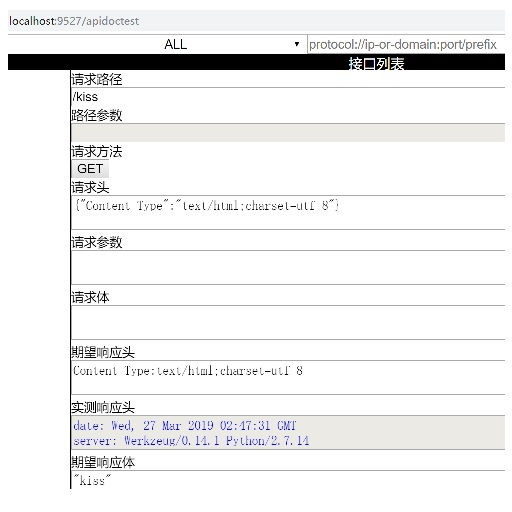

# APIDocTest
A lightweight Python WebAPI's documents and tests framework based on `__doc__`, VanillaJS-AJAX and Flask, but not limited to Flask.

## Details
Each of API handlers' `__doc__` line which starts with "@" will be treated as API's notes, excludes the leading spaces.
The "::" is the separator between key and value of each APIs='s note.
blanks in both ends of key and value are ignored.

|key|value(samples)|comments|
|:--|:----|:-------|
|@path-parameters|variablex=literalx & variabley=literaly & variablez=literalz|placeholders in router's url, such as "/path/to/<containeruuid>/status".|
|@request-parameters|variablex=literalx & variabley=literaly & variablez=literalz|like things after "?" in url, such as "http://nagexiucai.com/topic.php?title=ml-in-ten-pictures&md=ml-in-ten-pictures".|
|@request-headers|content-type:text/json;charset=utf-8 & user-agent:mozilla/5.0 gecko/20100101 firefox/38.0||
|@request-body|{"author":"bob-nx"}||
|@response-headers|content-type:text/html;charset=utf-8 & server:werkzeug/0.14.1 python/2.7.5||
|@response-body|"hi"||
|@norm|`==[caseignored]` or `~=[regular expression]` or ##|"==" for "same", "~=" for "similar", "##" for "silent"; if `"[extra]"` supplied, "extra" works.|

## Examples
The core is use `APIDocTest('router', ['methods'], name='name', description='description' version="version")` as handlers' first decorator.

```
from flask import blueprints
from apidoctest import APIDocTest

bapidoctest = blueprints.Blueprint("apidoctest", __name__)

@bapidoctest.route("/fuck", methods=["GET", "POST"])
@APIDocTest("/fuck", ["GET", "POST"], name="fuck", description="uncourteous.")
def Fuck():
    '''
    @path-parameters::
    @request-parameters::
    @request-headers:: Content-Type:application/json
    @request-body:: {"who":"unknown"}
    @response-headers:: Content-Type:text/html;charset=utf-8
    @response-body:: "fuck"
    @norm:: ==
    '''
    return "fuck"

import sys
reload(sys)
sys.setdefaultencoding("utf8")

from flask import Flask, request, render_template_string, json
from apidoctest import APIDocTestTemplateString
serv = Flask("APIDocTestDemo")
@serv.route("/apidoctest")
def documents():
    return render_template_string(APIDocTestTemplateString, data=json.dumps(APIDocTest.apidocs, encoding="utf-8"))
serv.register_blueprint(bapidoctest, url_prefix="/what")
serv.run(debug=False, host="localhost", port=9527)
```

## Result
Use browser(Google Chrome recommended), access `http://localhost:9527/apidoctest`(in examples above).




- 2xx: <font color='black'>black</font>
- 3xx: <font color='orange'>orange</font>
- 4xx: <font color='blue'>blue</font>
- 5xx: <font color='red'>red</font>

# ToDo
- I18n(Chinese friendly now)
- Parameters validation
- Input/Output grouped by test cases
- Input/Output type adaption
